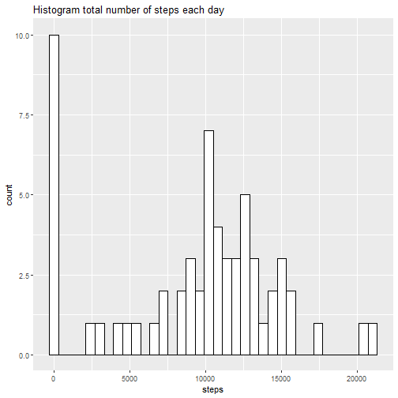
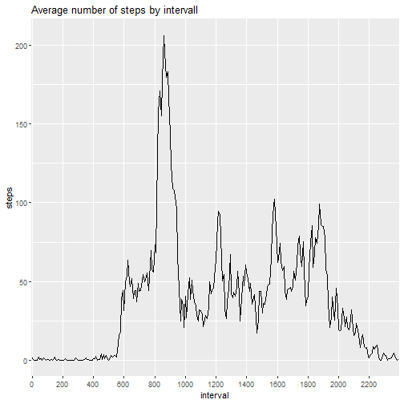
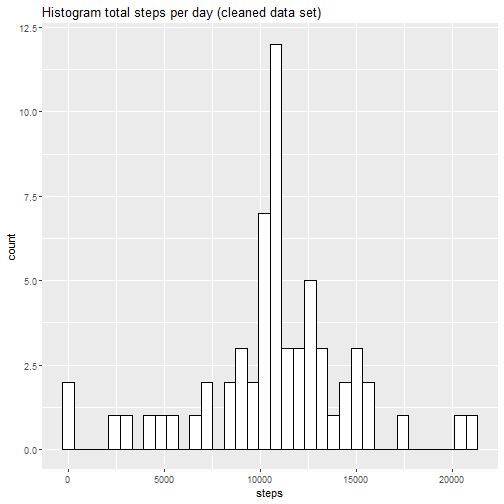
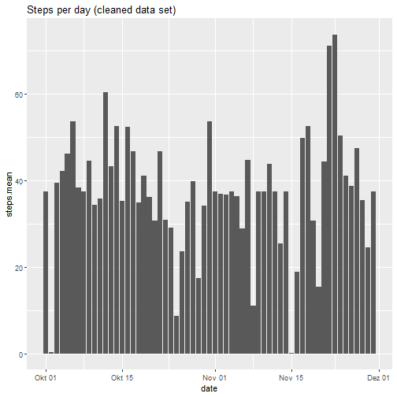
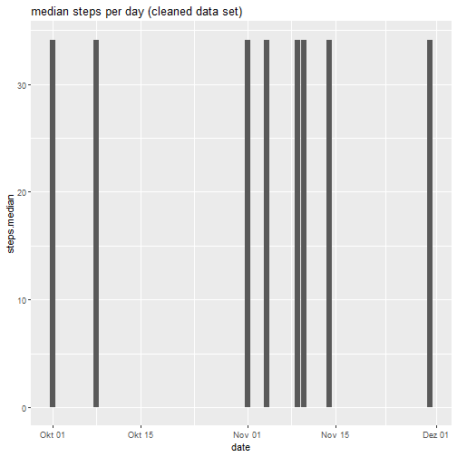
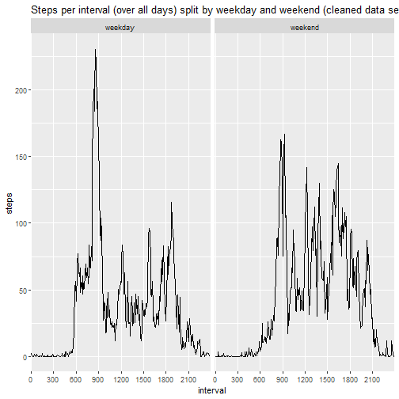

Coursera Assignment - Course Project 1
==================================================


```r
directory <- getwd()
unzip("activity.zip", exdir = directory)
```


```r
my.data <- read.csv("activity.csv", sep = ",", na.strings = "NA", header = T, stringsAsFactors = T)
my.data$interval <- as.factor(my.data$interval)
```


#What is mean total number of steps taken per day?
Calculate the total number of steps taken per day

```r
steps.perday <- aggregate(my.data$steps,by=list(my.data$date), sum, na.rm = T)
names(steps.perday) <- c("date", "steps")
print(summary(steps.perday))
```

```
##          date        steps      
##  2012-10-01: 1   Min.   :    0  
##  2012-10-02: 1   1st Qu.: 6778  
##  2012-10-03: 1   Median :10395  
##  2012-10-04: 1   Mean   : 9354  
##  2012-10-05: 1   3rd Qu.:12811  
##  2012-10-06: 1   Max.   :21194  
##  (Other)   :55
```

If you do not understand the difference between a histogram and a barplot, research the difference between them. Make a histogram of the total number of steps taken each day


```r
library(ggplot2)
ggplot(steps.perday, aes(x=steps)) + geom_histogram(color="black", fill="white", binwidth = 600)+ labs(title = "Histogram total number of steps each day")
```




#What is the average daily activity pattern?
Make a time series plot (i.e. type = "l") of the 5-minute interval (x-axis) and the average number of steps taken, averaged across all days (y-axis)

```r
interv.mean <- aggregate(my.data$steps,by=list(my.data$interval), mean, na.rm = T)
names(interv.mean) <- c("interval", "steps")
pos <- max(as.numeric(interv.mean$interval))
intervall <- as.numeric(as.character(interv.mean$interval))
range <- intervall[pos]
ggplot(data=interv.mean, aes(x=interval, y=steps, group=1)) +
  geom_line() + scale_x_discrete(breaks = seq(0, range, by = 200)) + labs(title = "Average number of steps by intervall")
```



Which 5-minute interval, on average across all the days in the dataset, contains the maximum number of steps?

```r
position <- order(interv.mean$steps, decreasing = T)
interv.mean[position[1],]
```

```
##     interval    steps
## 104      835 206.1698
```


#Imputing missing values

Calculate and report the total number of missing values in the dataset


```r
summary(my.data)
```

```
##      steps                date          interval    
##  Min.   :  0.00   2012-10-01:  288   0      :   61  
##  1st Qu.:  0.00   2012-10-02:  288   5      :   61  
##  Median :  0.00   2012-10-03:  288   10     :   61  
##  Mean   : 37.38   2012-10-04:  288   15     :   61  
##  3rd Qu.: 12.00   2012-10-05:  288   20     :   61  
##  Max.   :806.00   2012-10-06:  288   25     :   61  
##  NA's   :2304     (Other)   :15840   (Other):17202
```

Devise a strategy for filling in all of the missing values in the dataset. The strategy does not need to be sophisticated. For example, you could use the mean/median for that day, or the mean for that 5-minute interval, etc.


```r
mean.interval <- data.frame(interval = unique(my.data$interval), mean = tapply(my.data$steps, my.data$interval, mean, na.rm =T))
na.data <- my.data[is.na(my.data$steps),]
na.data$steps <- mean.interval[match(na.data$interval, mean.interval$interval),2]
summary(na.data$steps)
```

```
##    Min. 1st Qu.  Median    Mean 3rd Qu.    Max. 
##   0.000   2.486  34.113  37.383  52.835 206.170
```

Create a new dataset that is equal to the original dataset but with the missing data filled in

```r
my.data.new <- rbind(my.data[!is.na(my.data$steps),], na.data)
summary(my.data.new)
```

```
##      steps                date          interval    
##  Min.   :  0.00   2012-10-01:  288   0      :   61  
##  1st Qu.:  0.00   2012-10-02:  288   5      :   61  
##  Median :  0.00   2012-10-03:  288   10     :   61  
##  Mean   : 37.38   2012-10-04:  288   15     :   61  
##  3rd Qu.: 27.00   2012-10-05:  288   20     :   61  
##  Max.   :806.00   2012-10-06:  288   25     :   61  
##                   (Other)   :15840   (Other):17202
```

Make a histogram of the total number of steps taken each day and Calculate and report the mean and median total number of steps taken per day. 


```r
library(ggplot2)
steps.perday <- aggregate(my.data.new$steps,by=list(my.data.new$date), sum)
names(steps.perday) <- c("date", "steps")

steps.mean <- aggregate(my.data.new$steps,by=list(my.data.new$date), mean)
names(steps.mean) <- c("date", "steps.mean")
steps.mean$date <- as.POSIXct(steps.mean$date, tz="Europe/Berlin")
steps.median <- aggregate(my.data.new$steps,by=list(my.data.new$date), median)
names(steps.median) <- c("date", "steps.median")
steps.median$date <- as.POSIXct(steps.mean$date, tz="Europe/Berlin")

ggplot(steps.perday, aes(x=steps)) + geom_histogram(color="black", fill="white", binwidth = 600) + labs(title = "Histogram total steps per day (cleaned data set)")
```



```r
ggplot(steps.mean, aes(x=date,y = steps.mean)) +geom_bar(stat = "identity") + labs(title = "Steps per day (cleaned data set)")
```



```r
ggplot(steps.median, aes(x=date,y = steps.median)) +geom_bar(stat = "identity") + labs(title = "median steps per day (cleaned data set)")
```



Do these values differ from the estimates from the first part of the assignment? What is the impact of imputing missing data on the estimates of the total daily number of steps?

Before

```r
summary(my.data)
```

```
##      steps                date          interval    
##  Min.   :  0.00   2012-10-01:  288   0      :   61  
##  1st Qu.:  0.00   2012-10-02:  288   5      :   61  
##  Median :  0.00   2012-10-03:  288   10     :   61  
##  Mean   : 37.38   2012-10-04:  288   15     :   61  
##  3rd Qu.: 12.00   2012-10-05:  288   20     :   61  
##  Max.   :806.00   2012-10-06:  288   25     :   61  
##  NA's   :2304     (Other)   :15840   (Other):17202
```
After

```r
summary(my.data.new)
```

```
##      steps                date          interval    
##  Min.   :  0.00   2012-10-01:  288   0      :   61  
##  1st Qu.:  0.00   2012-10-02:  288   5      :   61  
##  Median :  0.00   2012-10-03:  288   10     :   61  
##  Mean   : 37.38   2012-10-04:  288   15     :   61  
##  3rd Qu.: 27.00   2012-10-05:  288   20     :   61  
##  Max.   :806.00   2012-10-06:  288   25     :   61  
##                   (Other)   :15840   (Other):17202
```

#Are there differences in activity patterns between weekdays and weekends?
Create a new factor variable in the dataset with two levels - "weekday" and "weekend" indicating whether a given date is a weekday or weekend day.


```r
pattern <- my.data.new
pattern$date <- as.POSIXct(my.data.new$date, tz="Europe/Berlin")
pattern$wday <- as.factor(ifelse(weekdays(pattern$date) == "Samstag" | weekdays(pattern$date) == "Sonntag", yes = "weekend", no = "weekday"))
summary(pattern$wday)
```

```
## weekday weekend 
##   12960    4608
```

Make a panel plot containing a time series plot (i.e. type="l") of the 5-minute interval (x-axis) and the average number of steps taken, averaged across all weekday days or weekend days (y-axis). See the README file in the GitHub repository to see an example of what this plot should look like using simulated data.


```r
pattern.split <- split(pattern, pattern$wday)
pattern.weekday <- data.frame(pattern.split[1])
names(pattern.weekday) <- c("steps", "date", "interval", "wday")
pattern.weekend <- data.frame(pattern.split[2])
names(pattern.weekend) <- c("steps", "date", "interval", "wday")

weekday.mean <- aggregate(pattern.weekday$steps,by=list(pattern.weekday$interval), mean)
weekday.mean$wday <- c("weekday")
names(weekday.mean) <- c("interval", "steps", "wday")

weekend.mean <- aggregate(pattern.weekend$steps,by=list(pattern.weekend$interval), mean)
weekend.mean$wday <- c("weekend")
names(weekend.mean) <- c("interval", "steps", "wday")

merge <- rbind(weekend.mean, weekday.mean)

posi <- max(as.numeric(merge$interval))
interv <- as.numeric(as.character(merge$interval))
rng <- interv[posi]

ggplot(data=merge, aes(x=interval, y=steps, group=1)) +
      geom_line() + facet_grid(.~wday)+ scale_x_discrete(breaks = seq(0, rng, by = 300)) + labs(title = "Steps per interval (over all days) split by weekday and weekend (cleaned data set)")
```


